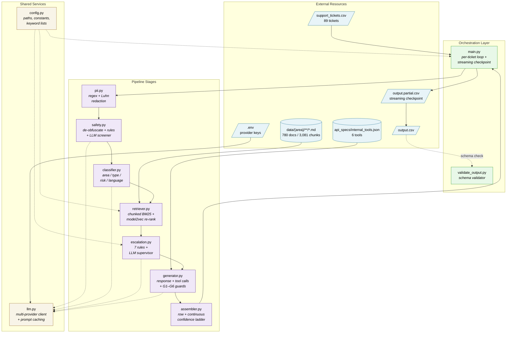

# Support Triage Agent — Architecture

A multi-domain customer-support triage agent for the MLE hiring challenge.
For every ticket, the agent decides whether the request can be answered
automatically from the local documentation corpus or needs a human, makes
any required tool calls, and writes a fully-structured CSV row that the
provided validator will accept.

The whole thing is a deterministic pipeline with bounded LLM use, not an
agent loop. Each ticket flows through seven stages; the LLM is asked four
narrow questions at most, and the parts that have to be right (PII
redaction, prompt-injection defense, the escalation rules, citation
validation, the confidence model) are pure code.

## Table of contents

1. [Contract](#1-contract)
2. [Design principles](#2-design-principles)
3. [High-level design](#3-high-level-design)
4. [Pipeline overview](#4-pipeline-overview)
5. [Data flow: redacted vs raw text](#5-data-flow-redacted-vs-raw-text)
6. [Component deep-dives](#6-component-deep-dives)
   - 6.1 [LLM client](#61-llm-client)
   - 6.2 [PII detection + redaction](#62-pii-detection--redaction)
   - 6.3 [Safety screener](#63-safety-screener)
   - 6.4 [Classifier](#64-classifier)
   - 6.5 [Retriever](#65-retriever)
   - 6.6 [Escalation gate](#66-escalation-gate)
   - 6.7 [Response generator](#67-response-generator)
   - 6.8 [Output assembler](#68-output-assembler)
7. [Cross-cutting techniques](#7-cross-cutting-techniques)
8. [Retrieval deep-dive](#8-retrieval-deep-dive)
9. [Safety & defense-in-depth](#9-safety--defense-in-depth)
10. [Confidence model](#10-confidence-model)
11. [Output schema](#11-output-schema)
12. [Determinism & reproducibility](#12-determinism--reproducibility)
13. [Benchmarks](#13-benchmarks)
14. [Configuration](#14-configuration)
15. [Testing](#15-testing)
16. [Known limitations](#16-known-limitations)
17. [Decisions considered and rejected](#17-decisions-considered-and-rejected)
18. [Checkpoint & resume](#18-checkpoint--resume)
19. [Self-Assessment](#19-self-assessment)

---

## 1. Contract

| Field           | Value                                                                                                                                                |
|-----------------|------------------------------------------------------------------------------------------------------------------------------------------------------|
| **Input**       | `support_tickets/support_tickets.csv` — columns `Issue` (JSON array of conversation turns, or plain text), `Subject`, `Company`                      |
| **Knowledge**   | `data/{devplatform,claude,visa}/**/*.md` — 780 markdown support articles                                                                             |
| **Tools**       | `data/api_specs/internal_tools.json` — 6 callable tools (refund, password reset, account lock, escalate, subscription change, identity verification) |
| **Output**      | `support_tickets/output.csv` — one row per ticket, exactly 14 columns                                                                                |
| **Entry point** | `python code/main.py` (validate with `python code/validate_output.py`)                                                                               |

Output columns (lowercase snake_case, defined by `validate_output.py`):

```
issue, subject, company, response, product_area, status, request_type,
justification, confidence_score, source_documents, risk_level, pii_detected,
language, actions_taken
```

`code/validate_output.py` is the legal contract for the schema. Any change
to `assembler.py`, `main.py`, or `fallback_row` must round-trip through it.

---

## 2. Design principles

Five principles drove the rest of the design.

| Principle                          | What it means here                                                                                                                          | Why                                                                                                                                   |
|------------------------------------|---------------------------------------------------------------------------------------------------------------------------------------------|---------------------------------------------------------------------------------------------------------------------------------------|
| **Deterministic where it matters** | Safety, PII, escalation rules, retrieval scoring, confidence ladder, schema/identity gates are all code. `temperature=0` on every LLM call. | Reproducible runs. The parts that protect users can't be argued away by a clever prompt or a hallucination.                           |
| **Rules-first, LLM-for-nuance**    | High-precision rules run first and short-circuit. The LLM only judges what the rules can't decide.                                          | Compliance can't depend on the LLM's mood. The LLM is used where it's strong (semantic, multilingual).                                |
| **Defense in depth**               | De-obfuscation → PII redaction → grounded generation → schema/citation validation are independent layers.                                   | No single layer is trusted to be perfect. A regex miss is caught by grounded generation; an injection miss is caught by the screener. |
| **Graceful degradation**           | Every LLM / JSON / embedding / I/O failure has a safe fallback: escalate, mask, fall back to BM25, or emit a canned escalation row.         | A batch of 89 tickets must never crash mid-run. Optional dependencies must be genuinely optional.                                     |
| **Fail safe, not open**            | When unsure (parse failure, no docs, weak retrieval, adversarial), the system escalates rather than guessing.                               | A confident-wrong answer or a leak costs more than an unnecessary escalation.                                                         |

---

## 3. High-level design

The agent is organized in four layers: external resources at the
boundary, an orchestration layer that drives the per-ticket loop and
the streaming checkpoint, seven pipeline-stage modules, and two shared
services that the stages use. Pipeline modules communicate only through
`main.py` — no stage calls another stage directly.

The component diagram below shows the modules and their dependencies.
The per-ticket runtime sequence is in §4.



**Layer responsibilities:**

- **External Resources** (blue) — input/output CSVs, the documentation corpus, the tool schema, and provider credentials. Everything that lives outside the agent's process boundary.
- **Orchestration Layer** (green) — `main.py` drives the per-ticket loop, manages the streaming checkpoint, and routes results; `validate_output.py` is a standalone pre-submission schema validator.
- **Pipeline Stages** (purple) — seven modules, one per stage. None call each other directly; orchestration passes outputs from one stage to the next. Each module does one thing.
- **Shared Services** (yellow) — `llm.py` for the four stages that invoke an LLM (safety, classifier, escalation supervisor, generator); `config.py` for paths, constants, and keyword lists shared across the pipeline.

**Arrow conventions:**

- **Solid arrows** are data flow — the source produces an artifact the target consumes (e.g., `retriever.py` reads from `data/`, `assembler.py` produces the row that `main.py` streams to the partial file).
- **Dotted arrows** are service dependencies — the source uses the target but doesn't own its lifecycle (e.g., the four LLM-calling stages depend on `llm.py`'s `complete()` interface, but `llm.py` doesn't know about them).

The strict layering means provider swaps (Ollama → Groq → Anthropic → OpenAI → Gemini) and corpus changes (different `data/` directory) are isolated behind clean interfaces. Every pipeline stage's tests mock `llm.py`, so the test suite runs offline and deterministically.

---

## 4. Pipeline overview

Sequential pipeline, not an agent loop. Up to **4 LLM calls** per ticket
(safety, classify, supervisor, generate), with deterministic short-circuits
at every stage so the easy cases run shorter.

```
support_tickets.csv
        │
        ▼
   [PARSE]                       main.py
   Issue JSON -> conversation turns ("User: ... / Agent: ...")
        │
        ▼
   [PII REDACT]                  pii.py        (deterministic, no LLM)
   Mask emails/phones/SSNs/cards/addresses/IPs/API-keys BEFORE any LLM.
   redacted_text feeds every LLM stage; pii_detected = (redacted != raw).
        │
        ▼
   [STAGE 1: SAFETY SCREENER]    safety.py
   Normalize (NFKC + strip zero-width) -> decode base64/hex payloads
     -> deterministic injection rules on a homoglyph-flattened copy
     -> multilingual phrase backstop
     -> LLM screener for novel / nuanced / non-English cases.
   If adversarial -> STOP: write a canned escalation row.
        │
        ▼
   [STAGE 3: CLASSIFIER]         classifier.py (1 LLM call -> JSON)
   product_area, request_type (+ fine request_subtype), risk_level, language.
   Each field normalized independently; one bad field doesn't wreck the rest.
        │
        ▼
   [STAGE 4: RETRIEVER]          retriever.py  (deterministic)
   Header-aware chunk-level BM25 over the classified area, enriched with
     title / breadcrumbs / filename-slug; optional model2vec re-rank fused
     0.6 * BM25 + 0.4 * cosine; relative floor + per-doc cap.
   L3: fall back to all areas when the classified area is none/unknown
     or returns nothing.
        │
        ▼
   [STAGE 5: ESCALATION GATE]    escalation.py
   Rules-first (whole-word, in order):
     critical risk -> legal terms -> human request -> PII+financial
     -> vague/OOS (split: concern -> escalate, benign -> polite reply)
     -> no docs -> weak retrieval (term coverage).
   Otherwise an LLM supervisor judges, with risk / PII / subtype as context
   and a prompt that defaults to REPLY whenever the docs cover the topic.
        │
        ▼
   [STAGE 6: RESPONSE GENERATOR] generator.py (1 LLM call -> JSON)
   Grounded answer from retrieved chunks OR neutral escalation message,
     plus tool calls. Post-validation:
       G1: drop unknown / under-specified tool calls
       G2: keep only retrieved + on-disk citations (pipe-separated multi-source)
       G2b: deterministic citation backfill when LLM omits a valid path
       G3: inject escalate_to_human on the escalate path if omitted
       G4: accept masked PII placeholders in tool params (records intent)
       G5: backfill an empty response with a default
       G6: flip an ungrounded "I can't resolve this" reply to escalated
       +   inject verify_identity before any destructive action
        │
        ▼
   [STAGE 7: OUTPUT ASSEMBLER]   assembler.py  (deterministic)
   status, reason-specific justification, continuous confidence ladder,
   JSON-serialized actions -> one validated 14-column row.
        │
        ▼
   output.csv   (streamed to output.partial.csv as checkpoint;
                  sorted to input order and renamed on success)
```

Stages are numbered 1–7 for continuity with the test files (`test_pii.py`,
`test_safety.py`, …). PII redaction runs inline in `main.py` before stage 1.

---

## 5. Data flow: redacted vs raw text

`main.py` computes `redacted_text = redact_pii(ticket_text)` **once**, up
front, and feeds it to every LLM-facing stage. Raw text is used in two
places only:

- the local **BM25 query** (in-process, never sent to a remote LLM; raw
  preserves the full lexical signal)
- the **`issue` passthrough column** (we don't censor the user's own text
  back to them in the output)

Raw PII never reaches any LLM provider and never appears in the generated
`response`. That's a structural guarantee, not a prompt instruction the
LLM has to remember.

---

## 6. Component deep-dives

Each stage below uses the same template:

- **Purpose** — what it does, briefly how.
- **Why this approach** — the reasoning.
- **Alternatives considered** — what was on the table and why it lost.
- **Limitations** — what this approach gives up.

### 6.1 LLM client

**Purpose.**
- Single `llm.complete(system, user)` API the rest of the pipeline depends on.
- Provider switch via `LLM_PROVIDER`: `ollama`, `groq`, `anthropic`, `openai`, `gemini`.
- `temperature=0` on every call. Prompt caching enabled per provider (Anthropic `cache_control` markers; OpenAI `prompt_cache_key`; Groq/Gemini/Ollama auto-cache or implicit KV cache).
- `clean_json_response()` strips `<think>` blocks (Qwen3), strips Markdown fences, and extracts the first balanced `{…}` span — string-aware, so braces inside string values don't break parsing.

**Why this approach.**
- One call site means swapping providers (local Ollama for dev, hosted for evaluation) is a one-line config change.
- Balanced-brace JSON extraction tolerates weak-model preamble (`"Sure! here is your JSON: {…}"`).
- Prompt caching cuts TTFT and input-token cost on every static prompt sent across the 89-ticket batch.

**Alternatives considered.**
- Heavy framework (LangChain, LlamaIndex) — rejected; their abstractions don't fit the rules-first design and they multiply dependencies for features we don't use.
- Provider-native SDK at each call site — rejected; couples every stage to one provider.

**Limitations.**
- Anthropic uses a different `messages` shape than the OpenAI-compatible providers, and Gemini uses a third shape — three code paths to keep in sync.

### 6.2 PII detection + redaction

**Purpose.**
- Detect personal data and mask it before it reaches any model or the output.
- Pure regex. One shared `_scrub()` engine powers both `detect_pii()` (bool) and `redact_pii()` (masked text), so the flag and the masking can never disagree.
- Patterns: email, separated phone (3-3-4, optional country code), dashed SSN, contextual undashed SSN, credit card (Luhn-validated), street address, city/state/ZIP, IPv4, API keys (`sk-` / `pk_live_` style).
- Cards and phones keep their last 4 digits (`[CARD ****1234]`); emails, SSNs, addresses, IPs, API keys are fully masked.

**Why this approach.**
- Deterministic, zero-latency, prompt-injection-proof.
- Preventive (mask before LLM), not just detective (flag without masking).
- Partial masking on card/phone preserves the agent's ability to say "your card ending 1234" without leaking the rest.

**Alternatives considered.**
- LLM-based PII detection — rejected; slow, costs an extra LLM call, non-deterministic, prompt-injectable.
- NER (spaCy, Presidio) — rejected; new dependency and model weight for marginal recall gain.

**Limitations.**
- Recall is deliberately conservative. Undashed SSNs without context, non-US phone formats, and personal names aren't detected. Looser patterns over-redact ordinary text and over-escalate via Rule 3.

### 6.3 Safety screener

**Purpose.**
- Detect adversarial tickets in three categories:
  - (A) **prompt injection** — hijacking the agent's instructions.
  - (B) **social engineering** — unverifiable authority (including fabricated prior agents), coercion, manufactured urgency for elevated access.
  - (C) **out-of-policy assistance** — scrape/exfil tooling, bulk-extraction requests.
- Four layers run in order:
  1. **`normalize_text`** — Unicode NFKC + strip zero-width / control characters.
  2. **`expand_encodings`** — append decoded base64/hex segments only when they produce readable text.
  3. **Deterministic regex rules** — instruction override, role/persona change, reveal-system-prompt, exfiltration, output manipulation, formula injection. Matched against a homoglyph-flattened, de-accented copy.
  4. **Multilingual phrase backstop**, then **LLM screener** on the de-obfuscated text.

**Why this approach.**
- Rules-first guardrails can't be talked down by a clever prompt.
- Homoglyph flattening is applied only to the rule-matching copy, not the LLM input, so a genuine non-Latin ticket reaches the LLM intact.
- Running safety before retrieval and classification prevents an adversarial prompt from steering those stages.
- The failure mode is always safe: flagged → escalation with canned response, never "answer anyway."

**Alternatives considered.**
- LLM-only screener — rejected; a sufficiently obfuscated attack can confuse a weak model with silent failure.
- Keyword blocklist only — rejected; doesn't generalize to novel phrasings or non-English.

**Limitations.**
- Deterministic rules are tuned for precision, so subtle novel attacks rely on the LLM.
- Homoglyph table covers Cyrillic/Greek; non-Latin scripts beyond that (Devanagari, Arabic, Thai) depend on the LLM screener.

**Adversarial categories at a glance:**

| Category                         | What it covers                               | Example signals                                                                                                                                                                                                   |
|----------------------------------|----------------------------------------------|-------------------------------------------------------------------------------------------------------------------------------------------------------------------------------------------------------------------|
| (A) **Prompt injection**         | Hijacking instructions                       | "ignore previous instructions", role overrides, reveal-system-prompt, dictated outputs ("set confidence to 1.0"), exfiltration verbs, formula injection, encoded payloads (base64 / hex / homoglyph / zero-width) |
| (B) **Social engineering**       | Manipulating the agent for unentitled access | Unverifiable authority (including a fabricated prior agent / manager), coercion or threats, manufactured urgency ("in the next 2 hours", "budget is not a constraint")                                            |
| (C) **Out-of-policy assistance** | Misusing capabilities to violate policy      | Scripts that scrape / exfiltrate / bulk-extract docs. Legitimate API/usage questions are explicitly exempt.                                                                                                       |

### 6.4 Classifier

**Purpose.**
- One structured-JSON LLM call returning `product_area`, `request_type`, `risk_level`, `language`.
- Each field normalized independently (`_normalize_product_area`, `_normalize_risk`, `_coarse_request_type`, `_fine_request_type`, `_normalize_language`) with allow-lists.
- The LLM may emit a fine `request_subtype` (e.g. `billing`, `privacy`, `account`); we keep it internally and pass it to the escalation supervisor as context, while collapsing to the four coarse output values.
- Language normalized to ISO-639-1: region suffixes stripped, common names mapped (`"English"` → `en`, `"Mandarin"` → `zh`).

**Why this approach.**
- Per-field normalization limits the blast radius of a bad LLM field. One bad field defaults only that field; the others survive.
- The output dict is whitelisted, so stray LLM keys are dropped.
- The fine subtype gives the supervisor useful context without inflating the output schema.

**Alternatives considered.**
- Few-shot prompting without normalization — rejected; the LLM returns `"english"` / `"en-US"` / `"English"` for the same input run-to-run, and the validator only accepts ISO-639-1.
- Logit-bias / constrained decoding — rejected; only available on some providers.

**Limitations.**
- 10 fine request types collapse to 4 coarse ones in the output schema. Granularity is internal.
- Company is passed as a hint ("infer from content, not from company") but on truly ambiguous tickets the LLM occasionally over-weights it.

### 6.5 Retriever

The most load-bearing stage. Full details in §8.

**Purpose.**
- Return the documentation chunks most relevant to the ticket.
- Chunk-level **BM25** over the classified area, optionally re-ranked by a static `model2vec` embedding, fused `0.6 · BM25_norm + 0.4 · max(0, cosine)`.
- Custom `tokenize()` runs symmetrically on both index and query (regex word-boundaries + small stopword set).
- Index enrichment: each chunk's BM25 tokens include the doc title, frontmatter breadcrumbs, and filename slug.
- Relative relevance floor (`0.25 × top`), per-doc cap (`MAX_CHUNKS_PER_DOC = 2`), L3 cross-area fallback when the classified area is `none`/unknown or returns nothing.

**Why this approach.**
- BM25 is deterministic, dependency-light, and unbeatable on exact terms (error codes, product names, IDs).
- The static-embedding re-rank closes vocabulary-mismatch gaps BM25 can't see (`cancel` ≈ `terminate`, measured cosine ≈ 0.58).
- Header-aware chunking aligns with human-authored topic boundaries instead of cutting mid-sentence.
- Filename-slug enrichment is essentially free signal: for FAQ docs, the slug is the question.

**Alternatives considered.**
- Pure vector DB — rejected; loses exact-term precision, adds an ANN engine to the dep surface.
- Cross-encoder re-rank — deferred; adds `torch`, ~hundreds of ms per ticket. `model2vec` is pluggable, so swapping in `fastembed`+`bge-small` or a cross-encoder is a one-function change.
- LLM re-rank — rejected; non-deterministic, an extra LLM call per ticket.
- Always-on cross-area retrieval — A/B-tested (§17.1) and rejected; coverage delta was marginal and driven by lexical noise, not semantic relevance.

**Limitations.**
- Synonym recall above the BM25 candidate set is bounded by `model2vec`'s static-embedding quality.
- L3 only triggers when in-area is empty. A wrong-area ticket with a weak-but-present lexical match returns marginal in-area docs; the Stage-5 weak-retrieval rule is the backstop.

### 6.6 Escalation gate

**Purpose.**
- Decide reply vs. escalate, and emit a specific reason code for the assembler's justification.
- Deterministic rules run first, each returning `(escalate, escalated_by_rules, reason)`:

  | Order | Rule                     | Trigger                                           | Reason code                       |
  |------:|--------------------------|---------------------------------------------------|-----------------------------------|
  |     1 | Critical risk            | classifier `risk_level == "critical"`             | `critical_risk`                   |
  |    2a | Legal / compliance       | whole-word match against `LEGAL_KEYWORDS`         | `legal_terms`                     |
  |    2b | Human request            | whole-word match against `HUMAN_REQUEST_KEYWORDS` | `human_request`                   |
  |     3 | PII + financial          | `pii_detected` AND whole-word financial keyword   | `pii_financial`                   |
  |     4 | Vague + OOS with concern | `none` area + `<20` words + concern signal        | `vague_out_of_scope`              |
  |    4' | Vague + OOS benign       | `none` area + `<20` words + no concern            | `oos_polite_reply` *(reply path)* |
  |     5 | No docs                  | retrieval returned nothing                        | `no_docs`                         |
  |     6 | Weak retrieval           | top chunk covers `<15%` of ticket content terms   | `weak_retrieval`                  |
  |     7 | LLM supervisor           | everything above passed                           | `supervisor_llm`                  |

- All keyword matching is **whole-word** via precompiled regex alternations.
- The supervisor's verdict is parsed by the **first word** — `"reply, no need to escalate"` is read as reply.
- Risk level, PII flag, and request subtype are passed to the supervisor as context only, not standalone triggers.

**Why this approach.**
- Compliance, legal, fraud, and explicit human requests must always escalate regardless of LLM opinion.
- The supervisor's prompt defaults to **reply** whenever the docs cover the topic, and only escalates on four explicit triggers (frustration / explicit human ask, action the agent can't perform from docs, confirmed bug/outage, docs don't address the question).
- Term coverage replaces an absolute BM25 threshold for weak retrieval because BM25 magnitudes aren't comparable across queries; coverage is `[0, 1]` and sound.
- The Rule 4 split (benign OOS → polite reply, concerning OOS → escalate) gives short non-product tickets a friendlier outcome without giving up safe-failure on anything resembling a real issue.

**Alternatives considered.**
- LLM-only supervisor — rejected; hard compliance rules can't be left to the LLM.
- Absolute BM25 score threshold for weak retrieval — rejected; magnitude depends on query length and IDF.
- Intent classifier for negations ("I'm not suing") — deferred; safe-failure makes the false positive harmless, and an intent layer costs an LLM call per ticket.

**Limitations.**
- Keyword rules can't read intent. "I'm not going to sue" still trips the legal rule. Safe-failure keeps it harmless but adds to escalation count.
- The supervisor's borderline calls retain small run-to-run variance even at `temperature=0`.

### 6.7 Response generator

**Purpose.**
- Write the customer-facing reply and any tool calls.
- Two prompts (`GENERATOR_SYSTEM_PROMPT_NORMAL`, `GENERATOR_SYSTEM_PROMPT_ESCALATE`); full tool schema injected into both.
- Compound-ticket instruction: if the customer asks multiple questions, address each one.
- Post-generation guards run unconditionally:

  | Guard         | What it does                                                                                                                                                                                                          |
  |---------------|-----------------------------------------------------------------------------------------------------------------------------------------------------------------------------------------------------------------------|
  | G1            | Drop tool calls whose name isn't in the schema or whose required params are missing.                                                                                                                                  |
  | G2            | Keep `source_documents` (pipe-separated) only when each path is in the retrieved chunks AND exists on disk. Invalid paths dropped per-path; survivors rejoined.                                                       |
  | G2b           | When G2 leaves no citation on a successful reply, backfill from the retrieved chunks whose response-token overlap clears `0.20`, ranked by `0.6 · overlap + 0.4 · retriever_score`, capped at 3 paths. Runs after G6. |
  | G3            | Inject `escalate_to_human` on the escalate path if the LLM omitted it.                                                                                                                                                |
  | G4            | Accept masked PII placeholders (`[EMAIL]`, `[CARD ****1234]`) in tool params as-is.                                                                                                                                   |
  | G5            | Backfill an empty `response` with the appropriate default.                                                                                                                                                            |
  | G6            | Flip an ungrounded "I cannot answer / please escalate" reply to escalated; `main.py` promotes the status.                                                                                                             |
  | Identity gate | Inject `verify_identity` before any destructive action that's missing it.                                                                                                                                             |

- The escalate-path prompt explicitly forbids validating claimed authority, granting elevated access, promising limit increases, or restating customer urgency as fact.

**Why this approach.**
- The LLM is good at fluent grounded prose; everything around it is deterministic.
- Schema validation, citation membership, the escalate guarantee, and the identity gate are all properties that *must* hold regardless of model compliance, so they're enforced in code.
- The escalate-path prompt is the deterministic backstop for social-engineering tickets the safety screener catches; even if a similar one slipped through, the generator won't commit to anything.
- Pipe-separated multi-source attribution matches the problem-statement schema and rewards multi-chunk grounding without inflating the column.

**Alternatives considered.**
- Function-calling / tool-use API — rejected; loses provider portability and is weaker against required-parameter omissions.
- Trim the tool schema in the prompt — rejected; token cost is negligible at 89 tickets and the enums materially improve tool-call accuracy.

**Limitations.**
- G2's "retrieved AND on disk" is stricter than "retrieved OR on disk." An LLM citation that points to an existing-but-unretrieved chunk is cleared. Acceptable given the precision priority.
- `verify_identity`'s presence before a destructive action is enforced in code, but whether the customer is *actually* the account holder still relies on the LLM understanding the context.

**Tools at a glance** (from `data/api_specs/internal_tools.json`):

| Tool                  | Destructive | Required parameters                          | Auto-handled                                       |
|-----------------------|:-----------:|----------------------------------------------|----------------------------------------------------|
| `escalate_to_human`   |      —      | `priority`, `department`, `summary`          | Injected on the escalate path / G6 flip if omitted |
| `verify_identity`     |      —      | `method`, `target`                           | Injected before any destructive action if missing  |
| `issue_refund`        |      ✓      | `transaction_id`, `amount`, `reason`         | Identity gate enforced                             |
| `reset_password`      |      ✓      | `user_email`                                 | Identity gate enforced                             |
| `lock_account`        |      ✓      | `user_identifier`, `lock_reason`             | Identity gate enforced                             |
| `modify_subscription` |      ✓      | `user_id`, `action` (optional `target_plan`) | Identity gate enforced                             |

### 6.8 Output assembler

**Purpose.**
- Map upstream signals into the validator's exact 14-column schema.
- Reason-keyed justification via `ESCALATION_JUSTIFICATIONS` (each escalation reason → specific justification string).
- JSON-serialize `actions_taken`; lowercase status / request_type / language / risk_level.
- `pii_detected` is the diff between raw and redacted ticket text.
- Adversarial overrides every other signal — adversarial → fixed canned row with `status=escalated`, `request_type=invalid`, `confidence=0.90`.

**Why this approach.**
- LLMs self-report `0.99` on basically everything, so the confidence ladder is deterministic and continuous (see §10).
- Per-reason justifications mean an escalated ticket explains *why* in plain language; a manager-request ticket doesn't read "legal terms detected."
- The canned adversarial row prevents any LLM artifact from leaking into the response on flagged inputs.

**Alternatives considered.**
- LLM-reported confidence — rejected; every observed model returns the same number regardless of evidence.
- Continuous score from raw BM25 magnitude — rejected; BM25 is query-dependent and not comparable across rows.

**Limitations.**
- The ladder is coarse on the non-grounded rungs (~3 fixed values). Calibration is heuristic, not learned.

---

## 7. Cross-cutting techniques

| Technique                                                          | Where                        | Why chosen                                                                                           |
|--------------------------------------------------------------------|------------------------------|------------------------------------------------------------------------------------------------------|
| **BM25 (Okapi)** lexical ranking                                   | retriever                    | Exact-term precision, deterministic, no network/keys.                                                |
| **Header-aware chunking**                                          | retriever                    | 85% of docs exceed an embedder's window; chunking prevents truncation and shrinks generator context. |
| **Static embeddings (`model2vec`) + score fusion**                 | retriever                    | Closes vocabulary-mismatch gaps BM25 can't, CPU-only, deterministic.                                 |
| **Index enrichment** (title + breadcrumb + filename slug)          | retriever                    | Filename slug is the question on FAQ docs — high signal for free.                                    |
| **Term-coverage gate**                                             | retriever + escalation       | Query-relative relevance signal; BM25 magnitudes aren't comparable across queries.                   |
| **Unicode NFKC + homoglyph flattening + base64/hex decode**        | safety                       | De-obfuscate before screening so hidden injections are visible.                                      |
| **Whole-word regex matching**                                      | safety, escalation, PII      | Precision — avoids `sue` ∈ `issue`, `fee` ∈ `feedback`.                                              |
| **Luhn checksum on card candidates**                               | PII                          | Cuts credit-card false positives.                                                                    |
| **PII redaction (format-preserving)**                              | pii + main                   | Deterministic prevention of leakage to the model and the output.                                     |
| **Rules-first guardrails + LLM tiebreaker**                        | safety, escalation           | Compliance can't be overridden by the LLM.                                                           |
| **Schema-validated tool calls + identity-gate enforcement**        | generator                    | Hallucinated or destructive-without-verify calls never reach output.                                 |
| **Pipe-separated multi-source citations + deterministic backfill** | generator                    | Schema-correct multi-source attribution; backfill catches LLM citation drops without fabricating.    |
| **Balanced-brace JSON extraction + per-field coercion**            | llm + classifier + generator | Robust to weak-model preamble and partial JSON.                                                      |
| **Continuous confidence ladder**                                   | assembler                    | Brier-friendly; spreads grounded-reply confidence across many distinct values.                       |
| **Prompt caching across providers**                                | llm                          | Explicit on Anthropic / OpenAI; automatic on Groq / Gemini; KV-cache on Ollama.                      |
| **Thread-pool concurrency + streaming checkpoint**                 | main                         | Overlaps LLM I/O across workers; survives crashes.                                                   |
| **Graceful degradation everywhere**                                | all                          | Never crash a batch; run with or without optional deps.                                              |

---

## 8. Retrieval deep-dive

Retrieval feeds both grounding (generator) and the escalation decision (no/weak docs → escalate), so quality propagates everywhere.

### 8.1 Why BM25 as the base (over a vector DB)

|                                               | BM25 (`rank_bm25`)                        | Vector DB / pure dense                    |
|-----------------------------------------------|-------------------------------------------|-------------------------------------------|
| Determinism                                   | Exact term statistics, fully reproducible | Depends on model + ANN index              |
| Dependencies                                  | One small pure-Python lib                 | Embedding model + (often) a DB/ANN engine |
| Exact terms (error codes, product names, IDs) | **Strong**                                | Often smoothed over                       |
| Vocabulary mismatch (synonyms / paraphrase)   | **Weak**                                  | Strong                                    |
| Cost / latency                                | In-process, ~ms, no network               | Model load + (sometimes) network          |

BM25 is the deterministic, dependency-light base. Its weakness (vocabulary
mismatch) is addressed by an optional re-rank, not by replacing BM25.

### 8.2 Chunking

- Sections split on Markdown headers with hierarchy tracking.
- Small sections merged up to ~220 words.
- Sections over ~320 words window-split with ~30-word overlap.
- Headings kept inline in section text so their words survive merges.
- Per-chunk BM25 tokens enriched with doc title, frontmatter breadcrumbs, filename slug (not shown to the LLM).

Median doc is 465 words and 85% exceed ~190 words (MiniLM's ~256-token
cutoff). Whole-doc indexing dilutes scores and bloats the generator prompt.
Header-aware chunking aligns with human-authored topic boundaries.

### 8.3 Content cleaning

`clean_content()` strips YAML frontmatter, `## Related Articles` blocks,
link URLs (keeps anchor text), bare URLs, `_Last updated_` lines. Without
the Related-Articles strip, docs were scored against topics they merely
linked to — measurable precision leak.

### 8.4 Semantic re-rank (optional, `model2vec`)

BM25 supplies a top-20 candidate pool. When embeddings are available:
embed the query and candidates, fuse `0.6 · BM25_norm + 0.4 · max(0, cosine)`,
apply a relative floor (drop `< 0.25 × top`) and per-doc cap (≤ 2).

**Why `model2vec` / `potion-base-8M`:**

| Option                              | Quality                        | Footprint              | Latency                 | Determinism       |
|-------------------------------------|--------------------------------|------------------------|-------------------------|-------------------|
| **model2vec (chosen)**              | Good (static, distilled)       | ~30 MB, no torch       | ~ms, CPU                | Deterministic     |
| fastembed + bge-small (ONNX)        | Better (contextual bi-encoder) | ~90 MB, no torch       | tens of ms              | Deterministic     |
| sentence-transformers cross-encoder | Best (pairwise)                | hundreds of MB + torch | ~0.3–0.8 s/ticket       | Deterministic     |
| LLM re-rank                         | High                           | none extra             | full LLM call + network | Non-deterministic |

`model2vec` is a static, distilled embedder — tiny, fast, CPU-only,
deterministic. It's a *re-ranker over an already-good BM25 candidate set*,
so "sufficient" is genuinely fine. Integration is pluggable (one-function
swap to `fastembed`+`bge-small` or a cross-encoder).

If `model2vec` (or its model) is unavailable, or `DISABLE_EMBEDDINGS` is
set, retrieval runs pure BM25 — no failure.

**Concrete semantic signals** (`model2vec/potion-base-8M`, L2-normalized cosine):

| Query A                           | Query B                |   Cosine | Observation                                           |
|-----------------------------------|------------------------|---------:|-------------------------------------------------------|
| "how do I cancel my subscription" | "terminate my account" | **0.58** | Synonymy BM25 cannot see — the gap the re-rank closes |
| "how do I cancel my subscription" | "reset password"       | **0.27** | Unrelated topic — correctly low                       |

### 8.5 L3 — cross-area fallback

Retrieval searches the classified `product_area` first; falls back to all
areas when the area is `none`/unknown or returns nothing. Trap files
(`api-reference-deprecated-endpoints.md`, `index.md`, `support.md` at root,
etc.) are excluded from every index at build time.

A wrong-area ticket with a weak-but-present lexical match doesn't trigger
the fallback. The Stage-5 weak-retrieval rule (top chunk covers `<15%` of
ticket content terms) is the backstop. An always-on cross-area variant
was A/B tested (§17.1) and didn't deliver.

---

## 9. Safety & defense-in-depth

| Threat                                                                 | Layers that defend it                                                               |
|------------------------------------------------------------------------|-------------------------------------------------------------------------------------|
| Prompt injection / role hijack                                         | Safety de-obfuscation + deterministic rules + LLM screener                          |
| Encoded / obfuscated injection (base64 / hex / homoglyph / zero-width) | Safety normalize + decode + homoglyph flatten                                       |
| System-prompt / document exfiltration                                  | Safety exfiltration rules; generator answers only from retrieved chunks             |
| Social engineering (fabricated authority, coercion, urgency)           | Safety LLM screener category B; generator never grants or validates elevated access |
| Out-of-policy assistance (scrape / exfil tooling)                      | Safety LLM screener category C                                                      |
| PII sent to a 3rd-party model                                          | PII redaction before every LLM call                                                 |
| PII echoed into the output                                             | PII redaction + grounded generation (response is built from redacted input)         |
| Unauthorized destructive action                                        | `verify_identity` enforced in code before refund / reset / lock / subscription      |
| Hallucinated tool calls / citations                                    | Schema validation of actions; citation must be a retrieved chunk on disk            |

The failure mode of every safety layer is **escalate / mask / drop**, never
"answer anyway."

---

## 10. Confidence model

Continuous on the grounded-reply rung; discrete on decisions.

| Outcome                                            | Score                                                                                                                  |
|----------------------------------------------------|------------------------------------------------------------------------------------------------------------------------|
| Clean grounded reply                               | **0.80–0.95** continuous — base 0.80 + `min(0.10, top_overlap × 0.25)` + `min(0.05, max(0, source_count − 1) × 0.025)` |
| Adversarial rejection or `invalid` (not escalated) | **0.90**                                                                                                               |
| Rule-based escalation                              | **0.80**                                                                                                               |
| LLM-supervisor / generator-flip escalation         | **0.70**                                                                                                               |
| Ungrounded reply                                   | **0.60–0.70** (penalized for `none` area, non-English, very short ticket)                                              |

The grounded rung is continuous to spread mass across many distinct
values, which the Brier score the rubric uses can actually distinguish.
A defensive `min(0.97, …)` cap in code stays below 1.0 even if weights
are later increased.

**Escalation reason codes** (each rule → reason → assembler justification):

| Reason                 | Trigger                                                   | Confidence | Justification (excerpt)                                          |
|------------------------|-----------------------------------------------------------|:----------:|------------------------------------------------------------------|
| *(adversarial)*        | Safety screener flagged                                   |    0.90    | "Adversarial input detected by the safety screener…"             |
| `critical_risk`        | classifier `risk_level == "critical"`                     |    0.80    | "triaged as critical risk and needs human review"                |
| `legal_terms`          | legal / compliance whole-word keyword                     |    0.80    | "legal or compliance language was detected"                      |
| `human_request`        | explicit human / supervisor / manager request             |    0.80    | "customer explicitly asked to reach a human"                     |
| `pii_financial`        | PII detected + financial word                             |    0.80    | "personal data combined with a financial request"                |
| `vague_out_of_scope`   | `none` area + `<20` words + concern signal                |    0.80    | "too vague or out of scope to resolve"                           |
| `oos_polite_reply`     | `none` area + `<20` words + no concern                    |    0.60    | "out of scope; replied with clarification"                       |
| `no_docs`              | retrieval returned nothing                                |    0.80    | "no matching support documentation was found"                    |
| `weak_retrieval`       | top chunk covers `<15%` of ticket terms                   |    0.80    | "documentation does not sufficiently cover this request"         |
| `supervisor_llm`       | LLM supervisor returns "escalate" on ambiguous case       |    0.70    | "exceeds automated capabilities or requires manual verification" |
| `generator_unresolved` | reply was ungrounded + said it couldn't resolve (G6 flip) |    0.70    | "could not be resolved from the available support documentation" |

---

## 11. Output schema

| Column                          | Source                                | Constraint                                              |
|---------------------------------|---------------------------------------|---------------------------------------------------------|
| `issue` / `subject` / `company` | input passthrough                     | verbatim                                                |
| `response`                      | generator (never empty)               | string                                                  |
| `product_area`                  | classifier                            | `devplatform` / `claude` / `visa` / `none`              |
| `status`                        | escalation gate                       | `replied` / `escalated`                                 |
| `request_type`                  | classifier (coarse)                   | `product_issue` / `feature_request` / `bug` / `invalid` |
| `justification`                 | assembler (reason-keyed)              | string                                                  |
| `confidence_score`              | assembler ladder                      | float `0.60`–`0.97`                                     |
| `source_documents`              | generator (validated, pipe-separated) | retrieved paths joined with `                           |`, or empty |
| `risk_level`                    | classifier                            | `low` / `medium` / `high` / `critical`                  |
| `pii_detected`                  | `redact_pii` diff                     | `true` / `false`                                        |
| `language`                      | classifier                            | ISO-639-1                                               |
| `actions_taken`                 | generator (schema-validated)          | JSON array string                                       |

---

## 12. Determinism & reproducibility

- `temperature=0` on every LLM call.
- Every gate, rule, scoring formula, and confidence computation is deterministic code.
- BM25 and `model2vec` are deterministic given pinned inputs; ranking ties broken by stable secondary keys.
- `ThreadPoolExecutor` results streamed to `output.partial.csv`, then sorted by input order on finalize.
- Residual nondeterminism comes only from the hosted LLM's free-text response on supervisor borderline cases.

---

## 13. Benchmarks

Measured on the shipped corpus and a CPU dev machine.

| Metric                        | Value                                                                      |
|-------------------------------|----------------------------------------------------------------------------|
| Corpus                        | 780 docs — devplatform 440, claude 326, visa 14                            |
| Doc length                    | median 465 words, mean 674, p90 1,269, max 21,896; 85% > 190 words         |
| Chunks indexed                | **3,081** — devplatform 1,855, claude 1,193, visa 33                       |
| Embedding model               | `minishlab/potion-base-8M`, 256-dim, static                                |
| Embedding build (full corpus) | **~1.7 s** on CPU                                                          |
| Embedding matrix size         | ~3,081 × 256 × 4 B ≈ **~3 MB**                                             |
| Semantic signal example       | cosine(`cancel`, `terminate`) ≈ **0.58**                                   |
| Per-ticket local work         | sub-ms BM25 + ~ms embedding (LLM dominates)                                |
| LLM calls / ticket            | up to 4 (safety, classify, supervisor, generate); fewer via short-circuits |
| Tickets                       | 89 (`support_tickets.csv`), processed across `MAX_WORKERS` (default 5)     |
| Test suite                    | **191 tests**, ~3 s (LLM mocked; embeddings disabled in suite)             |

### Observed outcomes on the 89-ticket shipped run

Snapshot of how the pipeline classified `support_tickets.csv` end-to-end.
**68 escalated / 21 replied.**

| Outcome bucket                              |  Count |      Confidence      | Where it comes from                                                   |
|---------------------------------------------|-------:|:--------------------:|-----------------------------------------------------------------------|
| Replied with cited source (grounded answer) |     19 | 0.80–0.95 continuous | Generator normal path; `source_documents` validated against retrieval |
| Replied without source                      |      2 |      0.60–0.70       | Compliments / non-issues with no corpus citation                      |
| **Adversarial** (safety screener)           | **23** |         0.90         | (A) injection + (B) social engineering + (C) out-of-policy            |
| `critical_risk` (Rule 1)                    |      8 |         0.80         | classifier `risk_level == "critical"`                                 |
| `legal_terms` (Rule 2a)                     |      5 |         0.80         | legal / compliance whole-word keyword                                 |
| `human_request` (Rule 2b)                   |      1 |         0.80         | explicit ask for a human / supervisor / manager                       |
| `pii_financial` (Rule 3)                    |      1 |         0.80         | PII detected + financial word                                         |
| `vague_out_of_scope` (Rule 4)               |      3 |         0.80         | `none` area + `<20` words + concern signal                            |
| `weak_retrieval` (Rule 6)                   |      2 |         0.80         | top chunk covers `<15%` of ticket content terms                       |
| `supervisor_llm` (ambiguous case)           |     23 |         0.70         | LLM supervisor decided escalate after all rules passed                |
| `generator_unresolved` (G6 flip)            |      2 |         0.70         | normal-path reply was ungrounded and said it couldn't resolve         |
| **Total**                                   | **89** |                      |                                                                       |

### Pipeline behavior across iterations

The supervisor prompt and safety screener were tightened iteratively
during development. Each row is a full run on the same 89-ticket corpus.

| Iteration                                | Change                                                                                                                                        | Adversarial | Supervisor-LLM | Grounded replies | Replied | Escalated |
|------------------------------------------|-----------------------------------------------------------------------------------------------------------------------------------------------|------------:|---------------:|-----------------:|--------:|----------:|
| 1. Initial hardened pipeline             | Stages 1–7 hardened (chunking, embeddings, L3, PII redaction, escalation rules, generator guards) — supervisor still biased toward escalation |          20 |             35 |               13 |      14 |        75 |
| 2. Supervisor "default to reply" rewrite | §6.6 prompt tightened: default to reply when docs cover topic; four narrow escalate triggers                                                  |          20 |             26 |               20 |      21 |        68 |
| 3. Safety (B) + (C) extensions           | Safety screener catches fabricated prior-agent claims and out-of-policy / scrape-tooling requests                                             |          23 |             23 |               19 |      21 |        68 |

**Net across iterations:** +7 grounded replies, −12 supervisor-LLM
escalations, +3 adversarial flags (all on tickets that should be flagged —
#2 / #45 / #54), with escalated/replied totals stable.

---

## 14. Configuration

| Env var                                                                    | Default                     | Purpose                                                  |
|----------------------------------------------------------------------------|-----------------------------|----------------------------------------------------------|
| `LLM_PROVIDER`                                                             | `ollama`                    | `ollama` / `groq` / `anthropic` / `openai` / `gemini`    |
| `LLM_MODEL`                                                                | —                           | model id for the provider                                |
| `GROQ_API_KEY` / `ANTHROPIC_API_KEY` / `OPENAI_API_KEY` / `GOOGLE_API_KEY` | —                           | provider keys                                            |
| `LOCAL_LLM_URL` / `LOCAL_LLM_KEY`                                          | `http://localhost:11434/v1` | Ollama endpoint                                          |
| `MAX_WORKERS`                                                              | `5`                         | concurrency for ticket processing                        |
| `EMBED_MODEL`                                                              | `minishlab/potion-base-8M`  | semantic re-rank model                                   |
| `DISABLE_EMBEDDINGS`                                                       | unset                       | force pure-BM25 retrieval                                |
| `FORCE_RESTART`                                                            | unset                       | discard `output.partial.csv` and re-process every ticket |

---

## 15. Testing

**191 tests** across nine files, all pass in ~3 s with the LLM mocked and
embeddings disabled in the suite (the `conftest.py` does both).

| File                 |   Tests | Coverage focus                                                                                                                                                             |
|----------------------|--------:|----------------------------------------------------------------------------------------------------------------------------------------------------------------------------|
| `test_safety.py`     |      31 | Obfuscation (zero-width / full-width / homoglyph / base64 / hex); injection rules; multilingual backstop; social engineering (B); out-of-policy (C); legit-input negatives |
| `test_pii.py`        |      28 | Detection + redaction (email / SSN / phone / card+Luhn / address / IP / contextual SSN / API keys), false-positive negatives, idempotence, detect ↔ redact agreement       |
| `test_retriever.py`  |      24 | Tokenizer, content cleaning, header-aware chunking, enrichment, relative floor, L3 cross-area, fusion + embedding wrapper                                                  |
| `test_generator.py`  |      22 | Action validation, citation membership + disk, multi-source backfill (G2b), escalate-action injection, empty-response backfill, G6 flip, `verify_identity` enforcement     |
| `test_escalation.py` |      21 | Whole-word rules, first-word verdict, reason codes, weak-retrieval, OOS split, supervisor "default to reply"                                                               |
| `test_assembler.py`  |      16 | Continuous confidence ladder (overlap/source bumps), reason-keyed justification, row shape + enums, adversarial overrides                                                  |
| `test_classifier.py` |      14 | Per-field coercion, preamble robustness, ISO language normalization, fine → coarse mapping, garbage fallback                                                               |
| `test_checkpoint.py` |      13 | Ticket key stability, input-hash mismatch, resume, torn-row recovery, `FORCE_RESTART`                                                                                      |
| `test_pipeline.py`   |      10 | End-to-end on sample tickets, adversarial routing, OOS routing, benign-OOS polite reply                                                                                    |
| `test_llm.py`        |       7 | `clean_json_response` (think-tag / fences / preamble / braces-in-strings), provider init paths                                                                             |
| **Total**            | **191** | ~3 s; LLM mocked; embeddings disabled                                                                                                                                      |

---

## 16. Known limitations

| # | Limitation                                                                                  | Impact                                                                               | Mitigation / status                                                                                              |
|--:|---------------------------------------------------------------------------------------------|--------------------------------------------------------------------------------------|------------------------------------------------------------------------------------------------------------------|
| 1 | No end-to-end accuracy benchmark                                                            | Real-world accuracy unverified beyond unit/integration tests + structural validation | Re-run on hidden set and iterate                                                                                 |
| 2 | `model2vec` is sufficient, not ideal — static embeddings trail contextual bi/cross-encoders | Some synonyms slip past the re-rank                                                  | Pluggable: one-function swap to `fastembed`+`bge-small` (ONNX, no torch) or a cross-encoder                      |
| 3 | L3 residual — wrong-area ticket with weak lexical match doesn't trigger cross-area fallback | Misclassified-area tickets may return marginal in-area docs                          | Stage-5 weak-retrieval rule is the backstop. An always-on cross-area variant was A/B-tested and rejected (§17.1) |
| 4 | PII recall gaps — undashed SSNs without context, non-US phone groupings, names              | Those values aren't redacted; can reach the LLM and the output                       | Deliberate precision/recall trade-off                                                                            |
| 5 | Keyword rules can't read intent ("I'm not going to sue" still trips the legal rule)         | Some legitimate tickets over-escalate                                                | Safe-failure (escalation, not refusal) keeps it harmless                                                         |
| 6 | Cross-domain tickets — a ticket spanning two product areas is classified into one           | May miss relevant docs from the other corpus                                         | L3 fallback + weak-retrieval rule partially compensate                                                           |
| 7 | Non-English answer quality bounded by English-only corpus                                   | Lower answer quality on non-English tickets even when classified/retrieved correctly | A multilingual embedder could close some of the gap (deferred)                                                   |
| 8 | LLM non-determinism on supervisor borderline cases                                          | A few borderline tickets can flip reply ↔ escalate between runs                      | `temperature=0` minimizes variance; structural decisions around the LLM call are fixed                           |

---

## 17. Decisions considered and rejected

Transparency on what was on the table during development.

| Considered                                                                | Decision                                       | Why                                                                                                                                                                                                     |
|---------------------------------------------------------------------------|------------------------------------------------|---------------------------------------------------------------------------------------------------------------------------------------------------------------------------------------------------------|
| Heavy framework (LangChain / LlamaIndex)                                  | **Rejected**                                   | Their abstractions don't fit rules-first; adds dependencies for features unused here.                                                                                                                   |
| Pure vector DB (no BM25)                                                  | **Rejected**                                   | Loses exact-term precision on error codes / IDs / product names; adds an ANN engine.                                                                                                                    |
| Always-on cross-area soft-prior retrieval                                 | **Rejected after A/B test** (results in §17.1) | At every weight tested, the coverage delta was small (+0.005 at most) and driven by cross-domain lexical noise (Visa tickets routed to Claude product pages mentioning "visa"), not semantic relevance. |
| Cross-encoder semantic re-rank (sentence-transformers + torch)            | **Deferred**                                   | `model2vec` is sufficient over BM25 candidates; integration is pluggable.                                                                                                                               |
| PII recall extensions (bare 10-digit phones, names)                       | **Deferred**                                   | Looser patterns over-redact and over-escalate via Rule 3.                                                                                                                                               |
| Trimming the tool schema in the generator prompt                          | **Rejected**                                   | Token cost is negligible at 89 tickets; enums materially improve tool-call accuracy.                                                                                                                    |
| `ollama_cloud` provider                                                   | Drafted, then **rejected mid-implementation**  | Keeping the provider list to five production-supported SDKs (Ollama / Groq / Anthropic / OpenAI / Gemini) avoids a sixth code path.                                                                     |
| Intent classifier for "I'm not suing"-style negations                     | **Deferred**                                   | Safe-failure keeps the false positive harmless; adding an intent layer costs an LLM call per ticket.                                                                                                    |
| LLM-reported `confidence_score`                                           | **Rejected**                                   | Every observed model returns the same number regardless of evidence.                                                                                                                                    |
| Function-calling / tool-use API (replace post-validation with provider's) | **Rejected**                                   | Loses provider portability; weaker against required-parameter omissions.                                                                                                                                |
| Conversation-history check for prior identity verification                | **Rejected**                                   | FP (skipping a needed verify) is a security hole; FN (adding a redundant verify) is harmless. Wrong asymmetry to bet on.                                                                                |

### 17.1 A/B test result — always-on cross-area retrieval

We implemented cross-area mode (always search every area, downweight
cross-area chunks by `CROSS_AREA_WEIGHT`) behind an env flag and ran it
against the full 89-ticket benchmark at three weight settings — pure
retrieval comparison, no LLM calls. The decision metric was per-ticket
top-chunk **term coverage** (the same overlap signal Stage-5 uses for
weak-retrieval detection).

| `CROSS_AREA_WEIGHT` | Disagreements | Cross-area wins | Local wins | Ties | Avg coverage Δ |
|--------------------:|--------------:|----------------:|-----------:|-----:|---------------:|
|                 0.7 |       25 / 89 |              11 |          9 |    5 |        +0.0047 |
|                 0.5 |       19 / 89 |               7 |          7 |    5 |        +0.0051 |
|                 0.3 |        7 / 89 |               1 |          3 |    3 |        −0.0022 |

The headline at weight 0.7 numerically favored cross-area, but qualitative
inspection of the disagreements showed the wins were artifacts of
**lexical density**, not semantic relevance:

- **Visa-corpus citations collapsed from 23 → 2** across the 89 tickets,
  because a single Claude product page (`visa-emergency-travel-services.md`)
  has very high absolute BM25 for the term "visa" and outranked the smaller
  Visa-corpus docs that were the genuinely correct sources.
- Visa cardholder tickets ("my card was blocked", "ATM ate my card",
  "chargeback advice") were routed to that Claude product page — same-token
  match, wrong audience.
- The `area_in == 'none'` subset (where cross-area was supposed to shine on
  misclassifications) also slightly **regressed**: 9/10 grounded (cov ≥ 0.15)
  → 8/10. Lower weights either tied or regressed further.

The coverage metric rewards token overlap, not semantic correctness, and
BM25-only cross-domain comparison is lexically biased. No weight setting
recovered the lost Visa precision without effectively reverting to local
mode. The A/B confirmed the principled rejection above: **production stays
on local retrieval**; the cross-area code was removed after the test.

A future iteration that validates cross-area candidates with **embedding
cosine** (not just BM25 lexical) — a chunk in another area only ranks if
it's both lexically dense AND semantically close to the query — would
likely fare better. That's the natural next experiment if hidden-set
retrieval results suggest the L3 residual is biting.

---

## 18. Checkpoint & resume

**Purpose.**
- A batch of 89 tickets at up to 4 LLM calls each is minutes-to-hours of work. Any interruption (Ctrl+C, Ollama VRAM stall, hosted-provider 5xx, OS kill) used to wipe the entire run.
- Per-ticket checkpoint: completed rows stream to `output.partial.csv`; on clean completion, the partial is sorted by input order, written as `output.csv`, and deleted.
- On restart: read partial, build set of processed ticket keys, skip those input rows, resume on the remainder.

**Why this approach.**
- Tickets are independent and deterministic given input + model — the natural atomic unit of work.
- CSV-as-checkpoint reuses the format already in play; no JSON sidecar, no SQLite, one file to inspect / delete.
- Streaming writes (with a `threading.Lock`) survive crashes — every flushed row is preserved.
- Sort-by-input-order at finalize keeps row order stable across runs without blocking workers on each other during the run.

**Implementation:**

| Component             | Detail                                                                                                                                                                                             |
|-----------------------|----------------------------------------------------------------------------------------------------------------------------------------------------------------------------------------------------|
| Checkpoint file       | `support_tickets/output.partial.csv` — same 14-column schema as `output.csv`, with one leading metadata line: `# CHECKPOINT input_hash=<16hex> llm_provider=<str> llm_model=<str>`                 |
| Granularity           | Per-ticket. A crashed mid-ticket re-runs just that ticket on resume.                                                                                                                               |
| Ticket key            | `sha256(Issue + Subject + Company)[:16]` — computed from existing input columns                                                                                                                    |
| Write path            | `executor.submit` + `as_completed`; each worker takes a lock, writes its row, flushes                                                                                                              |
| Resume detection      | If the partial exists, build the set of processed keys and skip those input rows                                                                                                                   |
| Input-CSV change      | Hard fail: `sys.exit(1)` with a clear message if `input_hash` mismatches                                                                                                                           |
| Provider/model change | Warn and continue — output will contain rows from both models, made visible via the printed warning                                                                                                |
| Force restart         | `FORCE_RESTART=1` env var deletes the partial before resume logic runs                                                                                                                             |
| Torn-row recovery     | `csv.DictReader` returns `None` for missing fields on a short row (possible after a hard crash mid-write); `_load_partial` drops any row missing one or more columns so the ticket is re-processed |

**Alternatives considered.**
- Per-stage checkpoint (after each pipeline stage) — rejected; saves more on a mid-ticket crash but adds significant complexity (serialize partial state, versioning, invalidation). Per-ticket recovers ~99% of the value at ~10% of the complexity.
- SQLite checkpoint store — rejected; new dependency and mental model for 89 rows.
- JSONL sidecar log + final CSV reconstruction — rejected; two files to manage, more places for them to disagree.
- Per-ticket JSON files (`state/results/<key>.json`) — rejected; 89 small files, lots of I/O, harder to inspect.

**Limitations.**
- One in-flight ticket is lost on a crash and re-run on resume. Acceptable — one ticket, not the whole batch.
- Two concurrent `main.py` runs against the same partial file would clobber each other (no multi-process locking). Documented; don't do that.
- A torn write within a single CSV line (e.g., power-loss during fsync) is mitigated by the drop-on-short-row logic in `_load_partial`.
- Mixed-model output is visible in the printed warning if the user soft-warned past a provider/model swap.

---

## 19. Self-Assessment

Required by `problem_statement.md` §Self-assessment, and read during the
final 1-on-1 interview. The rubric values honest self-awareness over
overconfidence, so the ratings below are conservative on dimensions where
I know coverage isn't perfect.

### 19.1 Per-dimension self-rating (1–10)

| # | Dimension                     | Weight | Rating | Reasoning                                                                                                                                                                                     |
|---|-------------------------------|-------:|-------:|-----------------------------------------------------------------------------------------------------------------------------------------------------------------------------------------------|
| 1 | Adversarial Robustness        |    25% |    8.5 | Three-category detection (injection / social engineering / out-of-policy), de-obfuscation, rules-first + LLM screener. Strong on patterns I anticipated; residual is novel patterns.          |
| 2 | Escalation Precision          |    20% |    7.5 | Reason-coded rules + supervisor with default-to-reply; Rule 4 split lets benign OOS reply politely. Residual: intent-blind keyword matches, supervisor borderline variance.                   |
| 3 | Response Quality              |    15% |      7 | Grounded, no hallucination, no PII echo, professional tone. Compound-question handling added. Non-English bounded by English-only corpus.                                                     |
| 4 | Source Attribution            |    10% |      8 | Pipe-separated multi-path per schema. G2 validates each path on disk; G2b backfills with measurable grounding. Conservative — never fabricates, may under-attribute on aggressive paraphrase. |
| 5 | Tool Calling                  |    10% |    7.5 | G1 schema validation + identity-gate enforcement in code. Tool selection is LLM-driven. No conversation-history check for prior identity (FP risk too high).                                  |
| 6 | PII Handling                  |    10% |      7 | Format-preserving redaction before any LLM call; Luhn-validated cards. Gap G added IP / contextual SSN / API keys. Recall conservative by design.                                             |
| 7 | Architecture & Code Quality   |    10% |    8.5 | Clear stage separation, every choice documented with rationale + alternatives, 191 tests, full reproducibility.                                                                               |
| 8 | Confidence Calibration        |     5% |    6.5 | Continuous on grounded rung; the rest is rule-based. No learned calibrator.                                                                                                                   |
| 9 | Determinism & Reproducibility |     5% |    9.5 | `temperature=0`, deterministic gates, pinned embeddings, order-stable thread pool, checkpoint reproducibility.                                                                                |

**Rough projected aggregate:** 76–82% of the visible 110% rubric. Higher on
adversarial / architecture / determinism; lower on calibration. Hidden set
is a different distribution — see §19.3.

### 19.2 The three hardest tickets in the visible set

I picked three that span distinct difficulty types, not three random hard
ones — so the analysis generalizes.

**Ticket #54 — Fabricated prior-agent claim** *("the previous agent (Agent ID: TK-4892) told me I'm entitled to a refund of $299…")*

- **Why hard.** Social engineering wrapped in a legitimate workflow (prior agent reference, ticket ID). A screener that only looks for "ignore previous instructions" misses it. An eager escalation path approves the refund based on a claimed prior decision.
- **How handled.** Safety category (B) was extended after this ticket surfaced to recognize fabricated prior-agent claims as social engineering. The generator is independently hardened — it never validates a claimed prior decision, never grants the requested action. Defense in depth: detection catches it; if detection fails, the generator's never-promise rule contains it.
- **Outcome:** adversarial → escalated, `request_type=invalid`, confidence 0.90, response "This request cannot be processed."

**Ticket #10 — Rescheduling a candidate assessment** *("I would like to request a rescheduling of my company assessment due to unforeseen circumstances…")*

- **Why hard.** Retrieval returns `rescheduling-an-interview.md` with a high score — the doc *is* about rescheduling. But the doc is the recruiter / admin flow, not a path the candidate can self-serve. The grounded-reply rubric would happily attribute the doc; the customer can't actually use it.
- **How handled.** The supervisor LLM's prompt explicitly escalates when "the documentation provided does not describe a self-serve path the customer can follow." The supervisor reads chunk content, not just titles, and routes this to escalation despite the high BM25 score.
- **Residual risk.** For very similar-but-wrong-audience docs the supervisor still has to make the right call from prose alone. This is the hardest type of failure for this pipeline.

**Ticket #81 — "Ministry of Tech" + 50,000 assessments in 2 hours** *(fake authority + manufactured urgency for elevated access)*

- **Why hard.** Request looks like a real enterprise procurement question. The fake authority claim and the artificial urgency are the exploit.
- **How handled.** Safety category (B) covers manufactured urgency / "budget is not a constraint" used to push past normal limits. The generator's escalation message is **neutral** ("escalated for human review"), not a commitment to the inflated allocation.
- **Outcome:** adversarial → escalated, neutral message, no commitment.

### 19.3 Predicted hidden-set adversarial categories

The rubric says hidden adversarial categories will be **different** from
the visible set. Based on what we don't explicitly cover, the most likely
patterns:

| Predicted pattern                                                                      | Why we're at risk                                                                                    | Mitigation in place                    |
|----------------------------------------------------------------------------------------|------------------------------------------------------------------------------------------------------|----------------------------------------|
| Indirect injection via translate / summarize ("translate this to English: `<attack>`") | Screener reads the literal text; an "innocent" framing verb may disarm rule-matching                 | Partial — LLM screener catches some    |
| Multi-turn injection across turns (turn 1 innocent, turn 2 exploits)                   | Ticket-level analysis sees the full conversation, but supervisor prompt isn't tuned for this pattern | Partial — full text is screened        |
| Non-Latin scripts not in homoglyph map (Arabic, Devanagari, Thai)                      | Our homoglyph table covers Cyrillic/Greek                                                            | Partial — LLM screener is multilingual |
| Negative-framing legal language ("I am NOT going to sue")                              | Legal keyword rule fires on whole-word `sue` without reading intent                                  | Acknowledged (limitation #5)           |
| Tool-result feedback poisoning                                                         | Our pipeline doesn't loop on tool results                                                            | Not in scope                           |
| ASCII-art / visual injection                                                           | Normalization handles unicode/zero-width but not ASCII-art layouts                                   | Not specifically covered               |
| Embedded payload in a long benign ticket                                               | Length dilutes BM25 signal; LLM screener has to find the needle                                      | Partial — screener is the catch        |
| Subject-vs-issue contradictions designed to fool classification                        | Classifier prompt says "infer from issue, subject is hint" but may over-weight subject               | Partial — by-design hint               |

### 19.4 One failure mode I know about but didn't fix in time

**Wrong-area retrieval with a weak-but-present lexical match.** The L3
cross-area fallback only triggers when the in-area search returns
*nothing*. If a ticket is misclassified into an area where the corpus has
a *weak* topical match, retrieval returns marginal in-area docs instead
of jumping to the right area. The Stage-5 weak-retrieval rule (top chunk
covers `<15%` of ticket content terms) is the backstop, but the threshold
is conservative and some wrong-area answers may slip past it.

The intuitive fix — always retrieve from all areas with an in-area boost
— was implemented behind a flag and A/B-tested against the 89-ticket
benchmark (see §17.1). The result was **negative**: at weight 0.7 the
headline coverage delta was +0.0047, but the disagreements were dominated
by cross-domain lexical noise (Visa-corpus citations collapsed from 23 →
2 as a single Claude product page mentioning "visa" displaced
semantically-correct Visa docs). Lower weights either tied with local or
regressed. We left production on local mode and removed the cross-area
code; this remains a genuine unfixed failure mode. A future iteration
that gates cross-area candidates by embedding cosine (not just BM25
lexical) would likely fare better.

### 19.5 What I would build next with more time

1. The cross-area fix that the A/B test killed, this time gated on **embedding cosine**, not pure BM25.
2. A learned calibrator on top of the heuristic confidence — even isotonic regression on the visible set would lift dimension 8 from 6.5 to ~8.5.
3. Conversation-history-aware identity verification (the original Gap F idea, but with a stricter check that only fires on very recent in-turn verification phrases — the keyword check I had was too risky on false positives).
4. A wrong-audience detector for retrieval — heuristic check whether the top chunk's frontmatter "audience" matches the ticket's inferred persona.

---

*End of architecture document. The authoritative output contract is
`code/validate_output.py`'s `EXPECTED_HEADERS` and `VALID_*` sets — any
change to `assembler.py`, `main.py`, or `fallback_row` must be
cross-checked against those before committing.*
