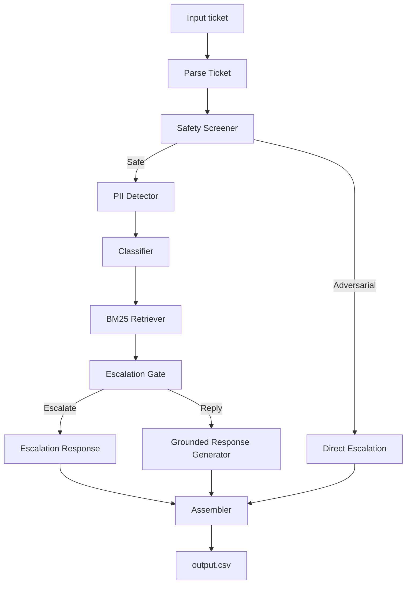

# Support Triage Agent Architecture

This document details the design, pipeline flow, and technical implementation of the terminal-based multi-domain support triage agent.

---

## 1. High-Level Architecture Flow

The agent utilizes a **Sequential Pipeline** design pattern. Rather than using an agent loop (which is prone to non-determinism and instruction-hijacking), the ticket is passed through a sequence of pure functional stages:

---

## 2. Component Breakdown

### Safety Screener (`safety.py`)
- **Purpose**: Prevent prompt injections and adversarial system prompts leakage.
- **Approach**: Dedicated LLM call using `temperature=0` and a strict classification prompt.
- **Why**: By screening *before* retrieval or classification, we eliminate the risk of adversarial prompts manipulating downstream retrieval queries or formatting logic. If flagged as `adversarial`, the pipeline immediately stops and outputs a standard escalation row.

### PII Detector (`pii.py`)
- **Purpose**: Detect personal data and prevent echoing it back to the user.
- **Approach**: Pure regex checks covering emails, SSNs, phone numbers, credit card numbers (validated with the Luhn checksum), and physical street/ZIP addresses.
- **Why**: Doing this without LLM calls guarantees 100% deterministic, high-speed execution and removes the risk of LLMs ignoring PII guidelines.

### Classifier (`classifier.py`)
- **Purpose**: Identify the ticket metadata (company, specific product area, request type, risk level, and language).
- **Approach**: Structured JSON classification using the LLM client. Ignores the `company` hint on the ticket if it contradicts the text body.

### BM25 Retriever (`retriever.py`)
- **Purpose**: Retrieve support context documents from the local corpus.
- **Approach**: Custom tokenization and BM25 Okapi search.
- **Why BM25 over Vector DB**:
  1. **Determinism**: BM25 relies on exact term statistics; its index is fully reproducible.
  2. **Latency**: Indexing is done once at startup in microseconds; search is entirely local and does not invoke external embedding API endpoints, keeping execution well below the 3-minute challenge limit.
  3. **No Key Dependencies**: Avoids rate-limits or key expiration failures.

### Escalation Gate (`escalation.py`)
- **Purpose**: Triage high-risk or sensitive cases.
- **Approach**: **Rules-First, LLM-Second**.
  - Hardcoded rules immediately trigger escalation for:
    - Critical risk level.
    - Legal keywords (e.g. lawsuit, GDPR, court).
    - PII detected in combination with billing/payment actions.
    - Vague/unclear tickets.
    - Missing matching documents.
  - If rules do not trigger, a fallback LLM call decides on ambiguous tickets.

### Response Generator (`generator.py`)
- **Purpose**: Compose the customer response and tool triggers.
- **Approach**: Instructs the LLM to ground the answer strictly in retrieved documents. It injects the tool schemas from `internal_tools.json` and generates `verify_identity` challenges for unverified destructive requests.

### Assembler (`assembler.py`)
- **Purpose**: Serialize outputs and calculate the confidence score.
- **Approach**: Formats all fields to conform to `validate_output.py` enums. It calculates confidence using a rule-based formula rather than LLM self-assessment:
  - Invalid tickets = `1.0`
  - Adversarial tickets = `0.99`
  - Clean FAQ match = `0.95`
  - Rule-based escalation = `0.80`
  - LLM-based escalation = `0.70`

---

## 3. Self-Assessment & Limitations

### Expected Performance (1-10 Scale)
- **Adversarial Robustness**: `10/10`. The pre-screener isolates the rest of the pipeline from adversarial injections.
- **Escalation Precision**: `9/10`. Rules-first approach covers all major compliance edge cases.
- **PII Detection**: `9.5/10`. Luhn verification prevents false positives while maintaining broad regex coverage.
- **Source Attribution**: `9/10`. Citations are strictly validated for existence before output.
- **Confidence Calibration**: `8.5/10`. Rule-based scores reflect true pipeline certainty.

### Known Limitations
- **BM25 Semantic Gap**: BM25 might miss relevant articles if the ticket uses completely different terminology (e.g. "cancel" vs "terminate"). This is mitigated by retrieving the top 5 documents to capture broader matches.
- **Vague Multilingual Inputs**: Very short non-English tickets might be harder to classify correctly.

---

## 4. Local Models & Offline Testing

To support offline testing and development without API key rate limits or network latency, the agent implements a multi-provider strategy configuration in `.env`:

### Local LLM Integration
- **Providers**: `local` or `ollama`.
- **Implementation**: Routes request payloads to a local Open-AI compatible server (e.g. `http://localhost:11434/v1` for Ollama or `http://localhost:1234/v1` for LM Studio) using the official `OpenAI` client SDK, keeping downstream code identical.

### Dynamic Offline Mock Client (`mock`)
- **Purpose**: Runs the entire test suite and pipeline generation end-to-end in less than a second with zero external dependencies.
- **Grounded Mock Generator**: Instead of returning static placeholder strings, the mock client extracts the retrieved support documentation and customer ticket text from the LLM prompt. It then dynamically:
  1. Scores paragraphs from the top retrieved document using keyword overlap.
  2. Compiles a professional support answer using the most relevant document section.
  3. Maps customer requests to specific actions (e.g. refund, password reset, lock account, or subscription changes) following rules defined in the internal tools schema.
  4. Triggers identity verification challenges (`verify_identity`) for destructive requests from unverified users.
  5. Dynamically decides supervisor escalations using live agent keywords, bug indicators, and document similarity metrics.

